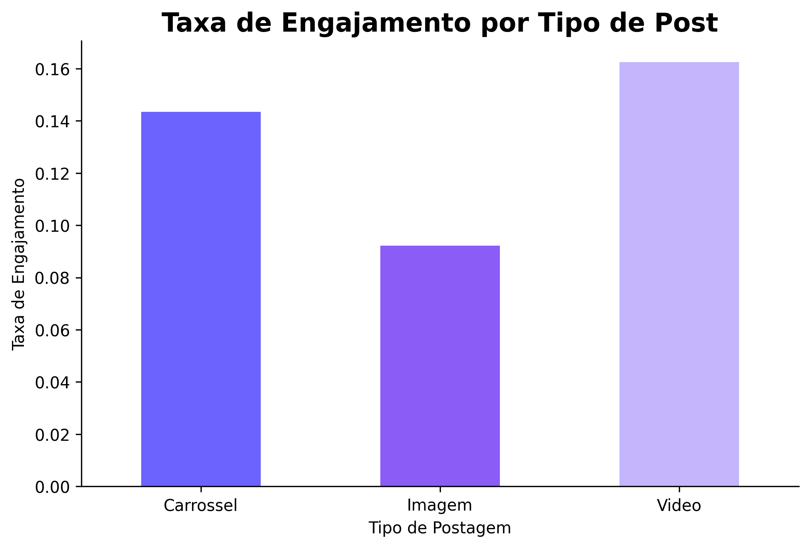

# 📊 Análise de Engajamento em Redes Sociais

Projeto desenvolvido com Python para análise de métricas de engajamento em redes sociais.

---

## 🚀 Objetivo

Identificar quais tipos de postagens geram maior engajamento com base em curtidas, comentários, compartilhamentos e visualizações.

---

## 🛠 Tecnologias utilizadas

- Python
- Pandas
- Matplotlib
- CSV

---

## 📈 Funcionalidades

✅ Leitura e tratamento de dados  
✅ Cálculo de taxa de engajamento  
✅ Agrupamento por tipo de postagem  
✅ Geração automática de gráfico  
✅ Visualização de insights

---

## 📂 Estrutura do projeto

```bash
analise-engajamento-redes/
│
├── dados/
├── img/
├── analise.py
├── requirements.txt
└── README.md
```

---

## 📸 Exemplo do gráfico gerado



---

## 💡 Insight obtido

Os vídeos apresentaram maior taxa média de engajamento em comparação com imagens estáticas.

---

## ▶️ Como executar o projeto

### Instalar dependências

```bash
pip install -r requirements.txt
```

### Executar projeto

```bash
python analise.py
```

---

## 👩‍💻 Sobre mim

Estudante de Tecnologia com foco em Ciência de Dados, desenvolvendo projetos voltados para análise de dados, automação e visualização de informações.
